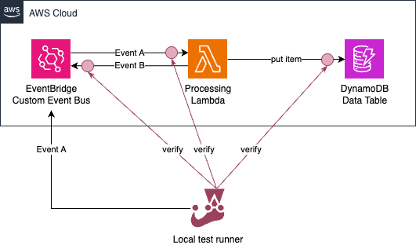

# Serverless Spy Demo

A CDK project utilizing [ServerlessSpy](https://serverlessspy.com/)
for integration tests.



For more details, see the article with full description: [Next-Level Integration Testing with ServerlessSpy](https://betterdev.blog/integration-testing-with-serverless-spy/).

## Install and Deploy

```bash
pnpm install
cdk deploy
```

## Run Integration Tests

```bash
pnpm test:integration
```

## Launch event monitoring console

```bash
pnpm sspy
```
